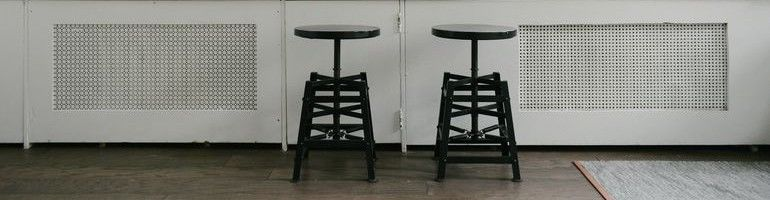

# Magang Phase 0 Week 5: Arrays and Logics

Selamat sudah melalui kegiatan pekan ke empat! Pekan kelima ini kita akan melatih pemahaman tentang logika dan implementasinya ke berbagai kasus. Pastikan kalian telah memahami dengan baik materi di minggu sebelum nya.

Karena sudah menginjak pekan ke 5, ada baiknya kamu menyelesaikan tugasnya dari hari ke hari secara rutin. Semaksimal mungkin tugas-tugas yang ada tidak ditumpuk di kemudian hari atau bahkan di akhir minggu, karena mulai pekan 5 ini setiap hari nya ada challenge coding yang menentukan kelanjutan ke phase 1 :bowtie: , dan semua challenge yang bertanda :anchor: ini wajib diselesaikan.

## Jumat - Logic Challenges Refresh

Gunakan waktu sejenak untuk berkenalan dengan Node Js,
sebuah platform yang memungkinkan kamu untuk menjalankan script JavaScript di server. Jadi, kamu bisa dengan mudah membuat kode JavaScript yang dapat berjalan di terminal kamu. Hari ini juga, kamu akan mencoba langsung mengimplementasi kodemu melalui node Js!

Materi & Referensi :

- :notebook_with_decorative_cover:
[Mengenal Node JS](/modules/js-node.md)
- :notebook_with_decorative_cover: [Membuat code JavaScript-mu dengan Baik ](modules/js-code-style.md)

Tugas :
- :anchor:
[[**Exercises 5 (Auto)**] Palindrome](/modules/challenge-palindrome.md)
- :anchor:
[[**Exercises 6 (Auto)**] Palindrome Angka](/modules/challenge-palindrome-angka.md)
- :anchor:
[[**Exercises 7 (Auto)**] Hitung Jumlah Kata](/modules/challenge-hitung-jumlah-kata.md)
- :anchor:
[[**Exercises 8 (Auto)**] Pasangan Angka Terbesar](/modules/challenge-pasangan-terbesar.md)

Tugas :

## Sabtu - More Logic Challenges

Hari baru, tantangan baru. Setelah belajar tentang array and solve berbagai problem dengan arrays, saatnya perbanyak latihan dengan soal yang terus melatih logika!

Tugas :

- :anchor:
[[**Exercises 9 (Auto)**] Cari Mean](/modules/challenge-cari-mean.md)
- :anchor:
[[**Exercises 10 (Auto)**] Perkalian Unik](/modules/challenge-perkalian-unik.md)
- :anchor:
[[**Exercises 11 (Auto)**] Deret Aritmatika](/modules/challenge-deret-aritmatika.md)
- :anchor:
[[**Exercises 12 (Auto)**] Deret Geometri](/modules/challenge-deret-geometri.md)

## Minggu - More Arrays + Multidimensional Array

Kamu telah mencoba berbagai macam soal, menggunakan array maupun tidak. Tentunya di saat ini kamu telah bisa menilai cara mana yang lebih baik menggunakan array, dan yang tidak perlu, bukan?

Hari ini, kamu akan bermain dengan array dan bentuk selanjutnya, yaitu array multidimensi. Tenang saja, array multidimensi konsep nya sama persis dengan array satu dimensi!

- :anchor:
[[**Exercises 13 (Auto)**] Target Terdekat](/modules/challenge-target-terdekat.md)
- :anchor:
[[**Exercises 14**] Mengelompokkan Angka](modules/challenge-kelompok-angka.md)
- :anchor:
[[**Exercises 15**] Mengelompokkan Hewan](modules/challenge-kelompok-hewan.md)

Jika ada hal yang perlu ditanyakan, langsung saja berdiskusi di grup ya.

Salam.
